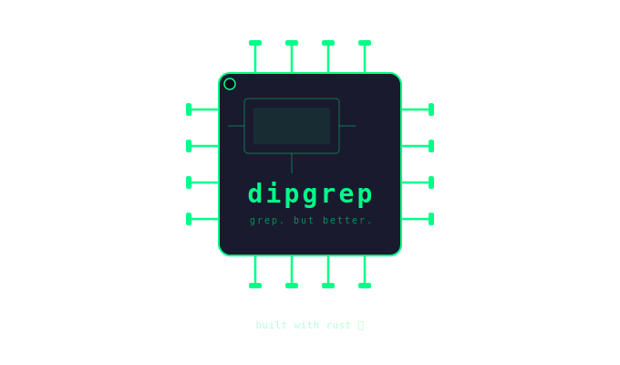
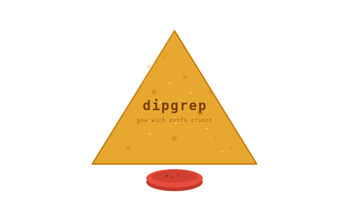
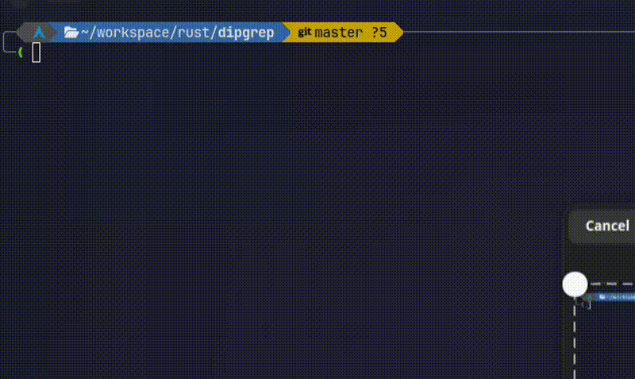

<div align="center">


&nbsp;&nbsp;&nbsp;&nbsp;&nbsp;&nbsp;


<sub><i>what i meant &nbsp;&nbsp;&nbsp;&nbsp;&nbsp;&nbsp;&nbsp;&nbsp;&nbsp;&nbsp;&nbsp;&nbsp;&nbsp;&nbsp;&nbsp;&nbsp;&nbsp;&nbsp;&nbsp;&nbsp;&nbsp;&nbsp;&nbsp;&nbsp;&nbsp;&nbsp;&nbsp;&nbsp;&nbsp;&nbsp;&nbsp;&nbsp; what i built</i></sub>

# dipgrep

**A fast, colorful grep alternative written in Rust.**

*Yes, I know. Another grep clone. But this one has a tortilla chip for a logo, highlights your matches in green, shows context instead of entire lines, and was written entirely by hand in Rust. So it's basically unrecognizable from grep.*

Context-aware output. Multiple search algorithms. Directory traversal.
Built for terminals that deserve better than walls of text.



<br/>

[](https://www.rust-lang.org/)
[](LICENSE)
[](https://github.com/EnvizyWasTaken)

</div>

---

## Why dipgrep?

Standard `grep` gives you walls of text. `dipgrep` gives you exactly what you need — the matched word highlighted, a few words of surrounding context, and the line number. Nothing more, nothing less.

Built entirely in Rust from scratch. Every line written by hand.

---

## Features

| | Feature |
|--|---------|
| 🎨 | **Colored output** — matches highlighted green, context dimmed gray |
| ✂️ | **Context extraction** — 2 words before and after each match |
| 📁 | **Directory search** — scan entire folders at once |
| 🔁 | **Recursive mode** — dig through nested directories with `-r` |
| 🔍 | **Four search algorithms** — linear, case-insensitive, exact word, regex |

---

## Installation

> Requires [Rust](https://rustup.rs/) to be installed.

```bash
git clone https://github.com/EnvizyWasTaken/dipgrep
cd dipgrep
cargo install --path .
```

`dipgrep` will now be available globally in your terminal.

---

## Usage

```
dipgrep -t <term> -p <path> [OPTIONS]
```

### Flags

| Flag | Long | Description |
|------|------|-------------|
| `-t` | `--term` | Search term or regex pattern |
| `-p` | `--path` | File or directory to search |
| `-a` | `--algorithm` | Search algorithm (default: `linear`) |
| `-r` | `--recursive` | Recurse into subdirectories |

### Algorithms

| Algorithm | Description |
|-----------|-------------|
| `linear` | Default. Fast substring search. |
| `insensitive` | Case-insensitive. `HELLO` matches `hello`. |
| `exact` | Whole word only. `log` won't match `logger`. |
| `regex` | Full regex patterns. `hel+`, `^fn `, `(foo\|bar)`. |

---

## Examples

```bash
# Search a file
dipgrep -t "hello" -p file.txt

# Search a directory
dipgrep -t "error" -p src/

# Recursive search from current directory
dipgrep -t "todo" -p . -r

# Case-insensitive
dipgrep -t "HELLO" -p file.txt -a insensitive

# Exact word match — won't match "helloworld"
dipgrep -t "hello" -p file.txt -a exact

# Regex patterns
dipgrep -t "hel+" -p file.txt -a regex
dipgrep -t "^fn " -p src/ -a regex -r
```

---

## Project Structure

```
src/
├── main.rs       — entry point, CLI wiring, output formatting
├── args.rs       — clap argument definitions
└── logic.rs      — search algorithms, file and directory traversal
```

---

## License

MIT — do whatever you want with it.

---

<div align="center">
<sub>Built with 🦀 by <a href="https://github.com/EnvizyWasTaken">envizy</a> — yes the chip was intentional</sub>
</div>
